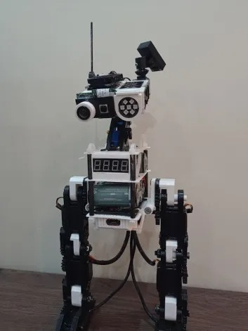
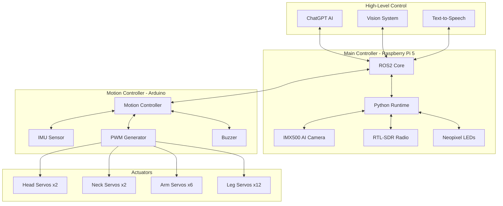

Official X account: https://x.com/DobbyBipedal

CA: 

</p>
# Dobby Robotics - Modular Biped

<p align="center">
  
</p>

<p align="center">
  <strong>Open-Source Modular Bipedal Robot Platform - Arduino + Raspberry Pi Powered</strong>
</p>

<p align="center">
  <a href="#overview">Overview</a> •
  <a href="#specifications">Specifications</a> •
  <a href="#assembly">Assembly</a> •
  <a href="#software-modules">Software</a> •
  <a href="#getting-started">Getting Started</a> •
  <a href="#documentation">Documentation</a>
</p>

<p align="center">
  
  
  
  
</p>

---

## Project Overview

The Modular Biped Robot Project provides a flexible framework for robotics development using Python and C++ on the Raspberry Pi and Arduino platforms. Buddy builds on the lessons learned from the original Archie release, offering improved stability, larger build size, and enhanced features.

### Key Features

| Feature | Description |
|---------|-------------|
| **Stable Platform** | Larger, more robust build for reliable operation and easier assembly |
| **Modular Design** | Custom PCBs for Raspberry Pi and Arduino, supporting rapid prototyping and expansion |
| **Servo Control** | SG5010 and TowerPro MG92B servos for leg, neck, head, and ear movement |
| **Vision** | Raspberry Pi-compatible camera module with wide-angle lens for vision input |
| **Audio** | Buzzer for simple audio output |
| **Neopixel Eye** | Adafruit Neopixel Jewel for expressive robot eye |
| **Sensor Integration** | MPU6050 accelerometer/gyroscope for balancing, RCWL-0516 microwave sensor for movement detection |
| **Power Management** | USB-C PD and 18650 battery support, XL4015 buck converters for safe voltage regulation |
| **3D Printed Parts** | STL files available for printing the robot body, joints, and accessories |
| **Open Source Code** | Python and C++ code for robot control, available on GitHub |

### Assembly Preview

<table>
<tr>
<td align="center" width="33%">


**Head Assembly**<br>
<sub>IMX500 AI Camera integration with pan-tilt servo mount. Features real-time face tracking and object detection.</sub>
</td>
<td align="center" width="33%">


**Body Assembly**<br>
<sub>Central torso housing Raspberry Pi 5, power distribution, and main controller board.</sub>
</td>
<td align="center" width="33%">


**Leg Assembly**<br>
<sub>Multi-DOF leg mechanism with high-torque servos for stable bipedal walking.</sub>
</td>
</tr>
</table>

### Full Assembly

<table>
<tr>
<td align="center" width="50%">


**Complete Assembly View**<br>
<sub>Full robot assembly showing all mechanical components and wiring layout.</sub>
</td>
<td align="center" width="50%">


**Neck Mechanism**<br>
<sub>2-DOF neck joint for head movement with cable management system.</sub>
</td>
</tr>
</table>

---

## Specifications

### Hardware Overview

| Component | Specification |
|-----------|---------------|
| **Main Controller** | Raspberry Pi 5 (8GB RAM) |
| **Motion Controller** | Arduino Mega 2560 |
| **Camera** | Sony IMX500 AI Camera |
| **Radio** | RTL-SDR USB Dongle |
| **Servos** | High-Torque Digital Servos |
| **Power** | LiPo Battery Pack (11.1V / 14.8V) |
| **Communication** | WiFi, Bluetooth, I2C, Serial |

### Servo Configuration

| Location | Type | Quantity | Function |
|----------|------|----------|----------|
| Head | Pan-Tilt | 2 | Camera orientation |
| Neck | Servo | 2 | Head movement |
| Arms | Standard | 6 | Arm articulation |
| Legs | High-Torque | 12 | Bipedal locomotion |
| **Total** | | **22 DOF** | |

### Degrees of Freedom (DOF)

```
                    HEAD (2 DOF)
                    ├── Pan (Yaw)
                    └── Tilt (Pitch)
                         │
                    NECK (2 DOF)
                    ├── Rotate
                    └── Tilt
                         │
            ┌────────────┼────────────┐
            │                         │
       LEFT ARM (3 DOF)          RIGHT ARM (3 DOF)
       ├── Shoulder Pitch        ├── Shoulder Pitch
       ├── Shoulder Roll         ├── Shoulder Roll
       └── Elbow                 └── Elbow
                         │
                    TORSO (0 DOF)
                         │
            ┌────────────┼────────────┐
            │                         │
       LEFT LEG (6 DOF)          RIGHT LEG (6 DOF)
       ├── Hip Yaw               ├── Hip Yaw
       ├── Hip Roll              ├── Hip Roll
       ├── Hip Pitch             ├── Hip Pitch
       ├── Knee Pitch            ├── Knee Pitch
       ├── Ankle Pitch           ├── Ankle Pitch
       └── Ankle Roll            └── Ankle Roll
```

**Total: 22 DOF**

---

## Software Modules

The software architecture is built on a modular design pattern, allowing each component to be developed, tested, and deployed independently.

### Core Modules

| Module | Description | Technology |
|--------|-------------|------------|
| **Animation** | Motion sequence playback and keyframe animation | Python |
| **ChatGPT** | Conversational AI integration with OpenAI API | Python |
| **Vision** | Computer vision and image processing with IMX500 | Python, OpenCV |
| **Tracking** | Real-time object and face tracking | Python, TensorFlow |
| **TTS** | Text-to-speech synthesis | Python |
| **Servos** | Low-level servo PWM control | C++, Arduino |
| **Neopixel** | RGB LED visual feedback | Python |
| **RTLSDR** | Software-defined radio processing | Python |
| **Braillespeak** | Text to Braille audio conversion | Python |
| **Motion Detection** | Microwave sensor integration | Python |
| **PiServo** | Raspberry Pi servo control | Python |
| **Translator** | Multi-language translation | Python |
| **Serial Connection** | RPi-Arduino communication | Python |
| **Viam** | VIAM API integration | Python |

### System Architecture



---

## Project Structure

```
DobbyRobotics/
├── arduino/                    # Arduino firmware
│   ├── servo_control/         # Servo PWM control
│   ├── imu_fusion/            # IMU sensor fusion
│   └── communication/         # Serial communication
├── python/                     # Python modules
│   ├── animation/             # Motion sequences
│   ├── chatgpt/               # AI integration
│   ├── vision/                # Computer vision
│   ├── tracking/              # Object tracking
│   ├── speech/                # Voice interaction
│   ├── neopixel/              # LED control
│   ├── rtlsdr/                # Radio processing
│   └── viam/                  # VIAM integration
├── ros2/                       # ROS2 packages
│   ├── Dobby_control/         # Control package
│   ├── Dobby_vision/          # Vision package
│   └── Dobby_msgs/            # Custom messages
├── hardware/                   # Hardware designs
│   ├── cad/                   # 3D models (STL/STEP)
│   ├── pcb/                   # PCB schematics
│   └── bom/                   # Bill of materials
├── images/                     # Documentation images
├── docs/                       # Documentation
├── configs/                    # Configuration files
├── tests/                      # Test scripts
├── requirements.txt            # Python dependencies
└── README.md                   # This file
```

---

## Getting Started

### Prerequisites

| Requirement | Version |
|-------------|---------|
| Python | 3.10+ |
| ROS2 | Humble / Iron |
| Arduino IDE | 2.0+ |
| CMake | 3.16+ |
| OpenCV | 4.5+ |

### Hardware Setup

1. **Raspberry Pi 5** - Flash Raspberry Pi OS (64-bit)
2. **Arduino Mega** - Connect via USB to Raspberry Pi
3. **IMX500 Camera** - Connect to CSI port
4. **Servos** - Wire to Arduino PWM pins
5. **Power** - Connect LiPo battery to power distribution board

### Software Installation

```bash
# Clone repository
git clone https://github.com/Dobby-PI/DobbyRobotics.git
cd BuddyRobotics

# Install Python dependencies
pip install -r requirements.txt

# Install ROS2 dependencies
rosdep install --from-paths ros2 --ignore-src -y

# Build ROS2 workspace
colcon build
source install/setup.bash

# Upload Arduino firmware
cd arduino/servo_control
arduino-cli compile --fqbn arduino:avr:mega
arduino-cli upload --fqbn arduino:avr:mega --port /dev/ttyUSB0
```

### Quick Start

```bash
# Launch full robot stack
ros2 launch Dobby_control full_robot.launch.py

# Run standalone vision module
python python/vision/camera_node.py

# Test servo control
python python/servo_test.py --port /dev/ttyUSB0

# Start ChatGPT interaction
python python/chatgpt/chat_interface.py
```

---

## Roadmap

- [x] Core servo control firmware
- [x] Basic locomotion algorithms
- [x] IMX500 camera integration
- [x] ChatGPT API integration
- [x] Neopixel LED feedback
- [x] RTL-SDR radio module
- [ ] Advanced bipedal walking gait
- [ ] Real-time SLAM navigation
- [ ] Gesture recognition
- [ ] Voice wake word detection
- [ ] Mobile app control interface
- [ ] Cloud telemetry dashboard

---

## Documentation

| Category | Description |
|----------|-------------|
| [Assembly Guide](docs/assembly.md) | Step-by-step assembly instructions |
| [Electronics Setup](docs/electronics.md) | Wiring diagrams and connections |
| [Software Setup](docs/software.md) | Software installation guide |
| [Troubleshooting](docs/troubleshooting.md) | Common issues and solutions |

---

## Contributing

We welcome contributions from the community! Please read our [Contributing Guidelines](CONTRIBUTING.md) before submitting pull requests.

1. Fork the repository
2. Create your feature branch (`git checkout -b feature/amazing-feature`)
3. Commit your changes (`git commit -m 'Add amazing feature'`)
4. Push to the branch (`git push origin feature/amazing-feature`)
5. Open a Pull Request

---

## License

This project is licensed under the GNU General Public License v3.0 - see the [LICENSE](LICENSE) file for details.

---

## Acknowledgments

- **Open Source Robotics Community** - ROS2 and related tools
- **Raspberry Pi Foundation** - Hardware platform
- **Arduino** - Microcontroller platform

---

<p align="center">
  <strong>Dobby Robotics</strong><br>
  <em>Building the Future of Personal Robotics - One Module at a Time</em>
</p>
